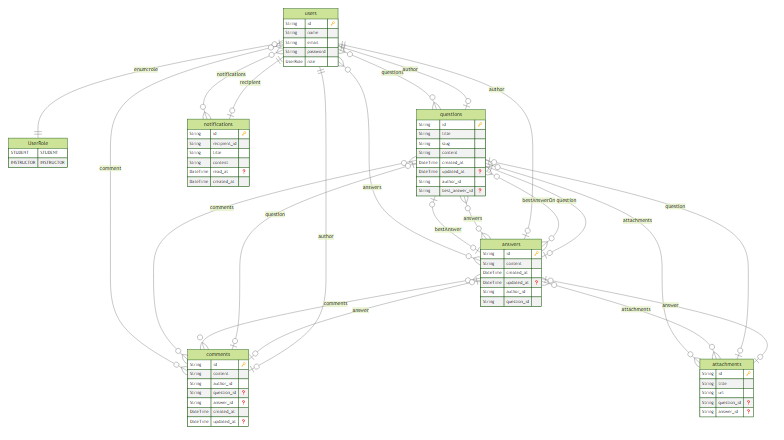

# Ignite Node - NestJS




> 🚀 Aplicação desenvolvida no Ignite curso da Rocketseat na trila de NodeJS, desenvolvida em NestJS, banco de dados em PostgreSQL rodando no docker, ORM foi usado o Prisma, autentitação em JWT.

## 🚀 Tecnologias
[](https://nodejs.org/en/s)
[](https://www.typescriptlang.org/docs/)
[](https://docs.docker.com/)
[](https://www.postgresql.org/docs/)
[](https://docs.nestjs.com)

## 💻 Pré-requisitos

Antes de começar, verifique se você atendeu aos seguintes requisitos:
<!---Estes são apenas requisitos de exemplo. Adicionar, duplicar ou remover conforme necessário--->
* Você instalou a versão mais recente de `<GIT / NodeJS / PNPM / PostgreSQL / Docker>`.
* Você tem uma máquina `<Windows / Linux / Mac>`.

## 🚀 Rodando a API em NestJS na sua máquina

Para rodar a API em NestJS na sua máquina, siga estas etapas:

## Clone this repository
``` 
$ git clone https://github.com/neanderdev/ignite-node-nestjs.git
```

## Go into the repository
```
$ cd ignite-node-nestjs
```

## Install dependencies
```
$ pnpm install
```

Antes de iniciar a aplicação, cria um arquivo na raiz do projeto chamado .env e .env.test (caso queira testar a aplicação usando outras variaveis de ambiente) e pega o exemplo das váriaveis de ambiente no arquivo .env.example e preencha com as suas informações.

## Run the database
```
$ docker compose up -d
```

## Run the app
```
$ pnpm start:dev
```

## 📫 Contribuindo para API em NestJS
<!---Se o seu README for longo ou se você tiver algum processo ou etapas específicas que deseja que os contribuidores sigam, considere a criação de um arquivo CONTRIBUTING.md separado--->
Para contribuir com API em NestJS, siga estas etapas:

1. Bifurque este repositório.
2. Crie um branch: `git checkout -b <nome_branch>`.
3. Faça suas alterações e confirme-as: `git commit -m '<mensagem_commit>'`
4. Envie para o branch original: `git push origin <nome_do_projeto> / <local>`
5. Crie a solicitação de pull.

Como alternativa, consulte a documentação do GitHub em [como criar uma solicitação pull](https://help.github.com/en/github/collaborating-with-issues-and-pull-requests/creating-a-pull-request).

## 🤝 Colaboradores

Agradecemos às seguintes pessoas que contribuíram para este projeto:

<table>
  <tr>
    <td align="center">
      <a href="#">
        <br>
        <sub>
          <b>Neander de Souza</b>
        </sub>
      </a>
    </td>    
  </tr>
</table>
